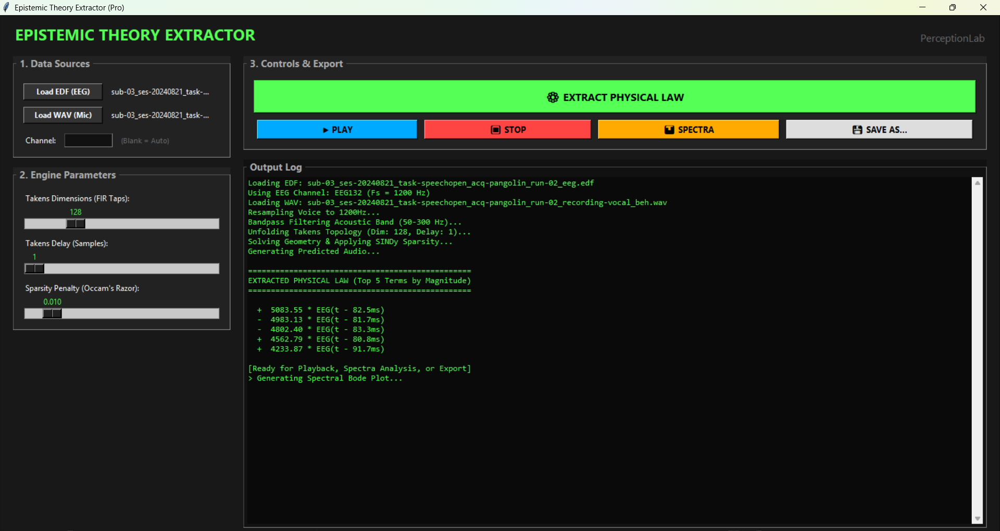
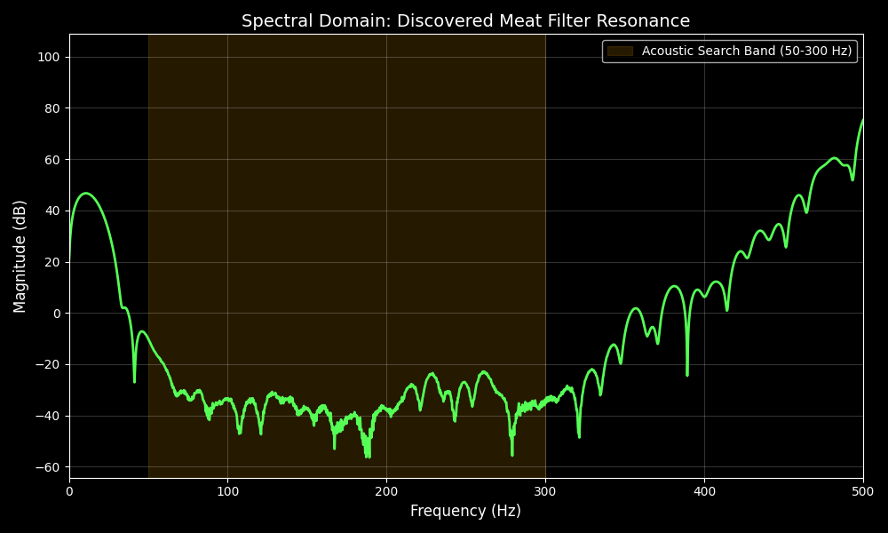

# **Epistemic Theory Extractor (The "Meat Filter" Analyzer)**

**PerceptionLab / Helsinki**  
An autonomous, epistemic AI tool designed to algebraically extract the linear physical transfer function mapping electrical brain activity (EEG) to acoustic speech (Voice).  
Unlike standard Deep Learning models that rely on gradient descent and black-box neural networks to guess relationships, this tool uses **Takens Delay Embedding** and **SINDy (Sparse Identification of Nonlinear Dynamics)** to algebraically deduce the explicit, human-readable laws of physics governing the acoustic resonance of the human skull and electrode hardware.

## **🧠 The Theory: Epistemic Signal Processing**

When analyzing simultaneous EEG and audio recordings during speech, the human head, skull, and electrode cables act as a physical, passive acoustic resonator (the "microphonic effect").  
To extract the exact physical shape of this resonator without hallucinating noise, this tool executes the following pipeline:

1. **Acoustic Isolation:** Bandpass filters both signals to the mechanical resonance band (50–300 Hz), stripping away massive, slow brain waves (Delta/Alpha) that would otherwise blind a linear solver.  
2. **Topological Unfolding (Takens' Theorem):** The 1D EEG signal is dynamically embedded into a high-dimensional Hankel matrix in RAM. This "unfolds" the hidden geometry of the biological system.  
3. **The Algebraic Solver:** Uses Moore-Penrose pseudo-inverses (via robust LAPACK gelsy drivers) to instantly find the flat geometrical plane mapping the unfolded EEG to the target Voice.  
4. **Occam's Razor (SINDy):** Applies Sequential Thresholded Least Squares (STLSQ). It violently crushes statistically weak dimensional connections to exactly 0.000, leaving behind only the sparse, mathematically rigorous Finite Impulse Response (FIR) filter.

## **✨ Features**

* **Professional Dual-Pane GUI:** Clean interface for data loading, parameter tuning, and real-time console output.  
* **Native EDF & WAV Support:** Uses mne to natively read EEG channels directly from .edf files, and automatically resamples the .wav audio to match the EEG clock.  
* **Instant Extraction:** Discovers the physical law algebraically in seconds. No epochs, no backpropagation.  
* **Spectral Analysis:** Converts the discovered time-domain FIR filter into a Frequency Response Bode Plot (via Discrete Fourier Transform) to visualize the exact resonant frequencies of the skull.  
* **Native Playback & Export:** Listen to the mathematically reconstructed audio instantly via sounddevice, and explicitly export both the .wav and a .txt log of the discovered physical laws.

## **⚙️ Installation**

The tool requires Python 3.8+ and standard scientific libraries.

Bash  
pip install numpy scipy mne soundfile matplotlib sounddevice

## **🚀 Usage**

Run the graphical interface:

Bash  
python epistemic\_pro\_gui.py

### **Workflow:**

1. **Load Data:** Select your .edf (EEG) and .wav (Microphone) files.  
2. **Select Channel:** Enter the target EEG channel (e.g., EEG132 or Cz). If left blank, the tool automatically selects the channel with the highest variance.  
3. **Set Geometry Parameters:**  
   * **Takens Dimensions:** The size of the FIR filter (e.g., 128 taps). This dictates how far back in time the model looks.  
   * **Takens Delay:** The spacing between samples in the unfolding (usually 1 for high-frequency acoustic analysis).  
   * **Sparsity Penalty:** The L1 SINDy threshold. Start low (0.005) to find the full continuous wave, or raise it to force the model to drop weaker acoustic echoes.  
4. **Extract:** Click **EXTRACT PHYSICAL LAW**. The UI will print the exact mathematical equation (e.g., Target(t) \= 11.00 \* EEG(t \- 2.5ms) \- 29.09 \* EEG(t \- 3.3ms)) to the console.  
5. **Analyze:** Play the reconstructed audio or click **SHOW SPECTRA** to view the resonance peaks in the frequency domain.

## **🔬 Interpreting the Output**

If SINDy "crushes 0 terms," this is not a failure of sparsity. It is mathematical proof that the skull's resonance is a *continuous, unbroken transfer of energy*. The printed coefficients represent the exact impulse response wave. The latency peak (the point of maximum coefficient magnitude) reveals the precise mechanical delay between the electrical signal and the acoustic recording.

### How this differs from head as resonator 1 repo: 

Repo 1 was at: https://github.com/anttiluode/HeadAsResonator

**1\. The Mathematics: Frequency Domain vs. Time-Space Geometry**

* **Initial Repo:** Used **Frequency Domain** math (Fourier Transforms / STFT). It calculated the transfer function by dividing the frequency spectrum of the EEG by the spectrum of the voice ($H(f) \= EEG(f) / Voice(f)$). To recover the voice, it applied an inverse frequency filter in the FFT domain.  
* **New Repo:** Uses **Time-Domain Geometry**. It uses Takens Delay Embedding to physically "unfold" the 1D EEG signal into a multi-dimensional topological shape (a Hankel matrix). It then uses linear algebra (Moore-Penrose pseudo-inverses) to find the flat geometric plane connecting the brain's topology to the microphone's topology.

**2\. The Algorithm: Statistical Averaging vs. Occam's Razor**

* **Initial Repo:** Smoothed the transfer function using median averages (np.median(H\_mag)) and Gaussian blurring to deal with noise.  
* **New Repo:** Uses **SINDy** (Sparse Identification of Nonlinear Dynamics). Instead of blurring noise, it applies a violent mathematical penalty (Sequential Thresholded Least Squares) to forcefully crush statistically weak connections to exactly 0.000. It actively strips away noise to find the minimal required physics.

**3\. The Output: Black-Box Audio vs. Epistemic Physical Laws**

* **Initial Repo:** The output was just an audio file and a spectrogram plot. You knew the audio sounded clearer, but the exact mechanism remained hidden inside the .npz arrays and FFT bins.  
* **New Repo:** It generates an **explicit, human-readable law of physics**. By printing Target(t) \= 11.0 \* EEG(t \- 2.5ms) ..., the system algebraically proves the exact mechanical latency and resonance of the physical setup (e.g., discovering the \~80ms acoustic delay peak automatically). It gives you the literal Finite Impulse Response (FIR) filter equation.

**4\. The Workflow: Two-Step vs. Autonomous**

* **Initial Repo:** Required running an analyzer script to generate a static transfer\_function.npz file, saving it to disk, and then loading it into a separate player or rendering script.  
* **New Repo:** A single, autonomous pipeline. You drop the raw .edf and .wav into the GUI. The system holds everything in RAM, dynamically discovers the law, renders the audio, and computes the spectral Bode plot all in one continuous workflow.

**5\. The Physics Handling (The Bandpass Fix)**

* **Initial Repo:** Tried to calculate the transfer function across the entire frequency spectrum, meaning the math was constantly fighting against massive, slow brain waves (Delta/Theta/Alpha) that had nothing to do with speech.  
* **New Repo:** Explicitly isolates the **Mechanical Acoustic Band (50-300 Hz)** before doing any geometry. By mathematically blinding the solver to the slow brain waves, it focuses purely on the frequencies where physical bone conduction and cable microphonics actually occur.

In short, the first repository was a signal processing tool that filtered audio. The second repository is an epistemic machine learning engine that discovers the physical laws of biological resonators.
